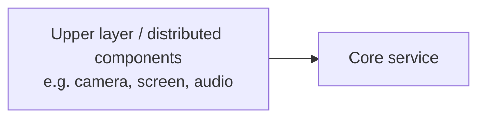

# Code Architecture Analysis

## Overview

Create a concise architecture report and Mermaid diagrams for developers, focusing on runtime boundaries and data flow.

## Workflow

1. Confirm scope and boundaries.
   - Ask which repository or set of repositories is in scope.
   - Confirm caller roles: external systems, applications, users, SDKs.
   - Confirm how to treat multi-repo subsystems and where the repository boundary is.

2. Collect context.
   - Read README and build files (CMakeLists.txt, Makefile, build scripts).
   - Scan top-level directories and public headers.
   - Identify entry points (main, exported C APIs, services, CLI, SDK entry).

3. Identify capabilities and modules.
   - Group by capability rather than directory name when possible.
   - Map each capability to concrete modules, targets, or directories.

4. Trace scenarios and call chains.
   - Start from caller roles and walk into entry points.
   - Follow flows across boundaries down to base dependencies.
   - Highlight cross-process (IPC) and cross-device (RPC/data channel) interactions.

5. Identify key dependencies.
   - List major third-party libraries and system or middleware dependencies.
   - Link dependencies to the modules that use them.

6. Draft the report.
   - Use references/analysis-template.md.
   - Keep it short, concrete, and free of speculation.

## Output Requirements

- Write the final report in Simplified Chinese.
- Use Markdown with a Mermaid flowchart (direction LR) and a readable Mermaid sequence diagram for data flow.
- Include four boundaries: caller boundary, repository boundary, in-repo service modules, base dependencies.
- Focus on boundary roles and cross-module calls; keep module-internal details coarse.
- **在连接线上标注通信类型（核心要求）**：流程图的每一条连线都必须标明它是「跨进程 IPC」「跨设备 RPC/数据通道」还是「进程内调用」，不要只画箭头不标类型——读者要能一眼看出系统的真实边界落在哪条线上。
  - 标签词表：`|IPC|`（跨进程，如 Proxy/Stub + MessageParcel、HdfIoService、Binder）、`|RPC|` 或 `|跨设备|`（跨设备/跨节点，如分布式软总线、网络数据通道）、`|进程内调用|`（同进程函数调用，无 IPC）、`|napi 绑定|` / `|进程内链接|`（同进程内的其他形态，如 JS→napi、应用链接客户端库）。
  - 图下方必须配一段**图例**，解释这些标签；若全仓无跨设备 RPC，要显式注明「本仓无跨设备 RPC」（例如所有 SA 的 `sa_profile` 均为 `distributed: false`，均在本机）。
  - 时序图里，在跨进程/跨设备的边界处用 `Note over A,B: 跨进程 IPC（...）` 显式标注，不要只靠箭头隐含。
  - 区分「代码在哪个进程」与「调用是否跨进程」：同一个 `hdi` 库代码可能链在 SA 进程内，但它经 `HdfIoService` 等到达**独立的驱动 host 进程**时，那一段仍是跨进程 IPC，需如实标注，不要误标为「进程内」。
- Use headings: "## 1. 进程与模块总体视图", "## 2. 核心模块职责（按边界划分）", and "## 3/4/5/.. . 典型运行场景一/二/三/..." with at least five scenarios.
- Ensure every "典型运行场景" includes a corresponding Mermaid diagram.
- Ensure Mermaid diagrams render without errors.
- If scope is unclear, ask for clarification before analyzing.
- If a conclusion is uncertain, say "我不知道。".
- Create a markdown file in `./.codex/` and save it there; create `./.codex/` if it does not exist.

## Mermaid Safety Rules (must follow)

- Use ASCII-only IDs for nodes/participants/subgraphs: `A-Za-z0-9_` only.
- Put every display label in double quotes.
- Do not use literal newlines or `\n` inside labels; use ` ` for line breaks.
- Keep special characters like `()`, `/`, `:`, `[]`, `|` out of IDs; if needed, keep them inside quoted labels.
- Quote subgraph titles: `subgraph Repo["Repository boundary"]`.
- In sequence diagrams, alias participants: `participant App as "Upper layer app"`.

### Edge labeling example (IPC vs in-process, on the lines)

> 本例展示了「两段跨进程」：Client→SA 是 IPC，HDI→HDF 驱动 host 也是 IPC；而 App→Client、Service→HDI 是进程内。边界落在带 `IPC` 的连线上，而不是模块框上。

## Template

- references/analysis-template.md
