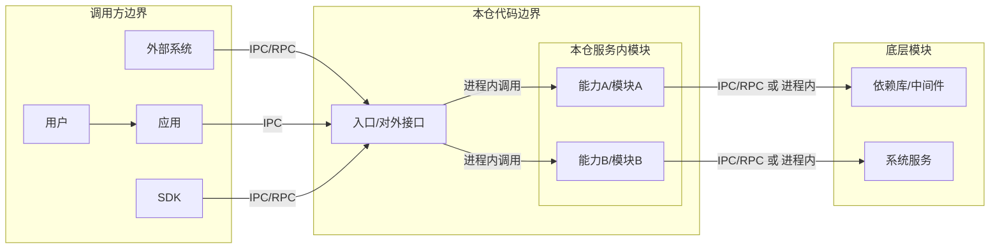
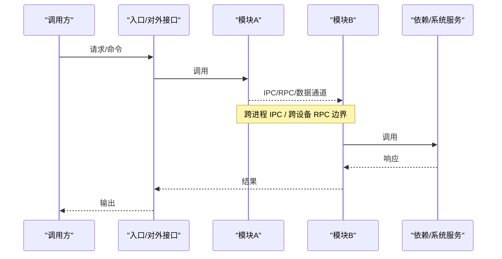
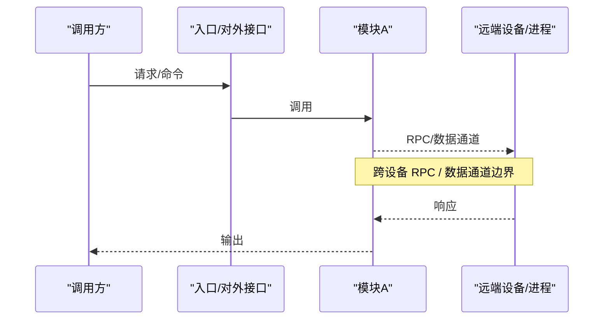
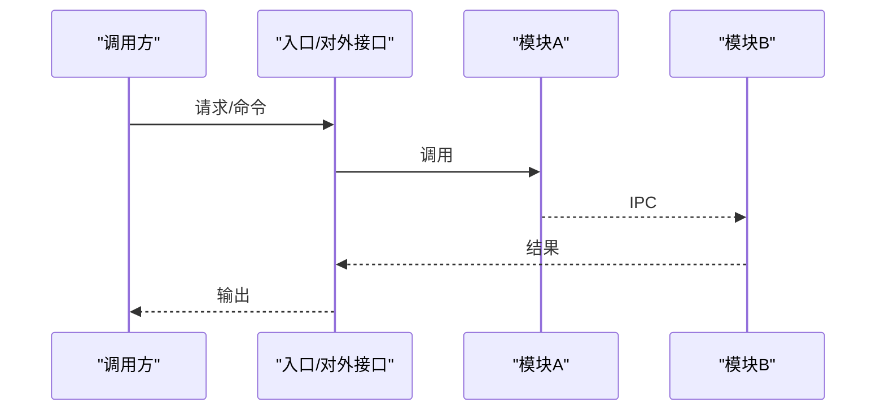
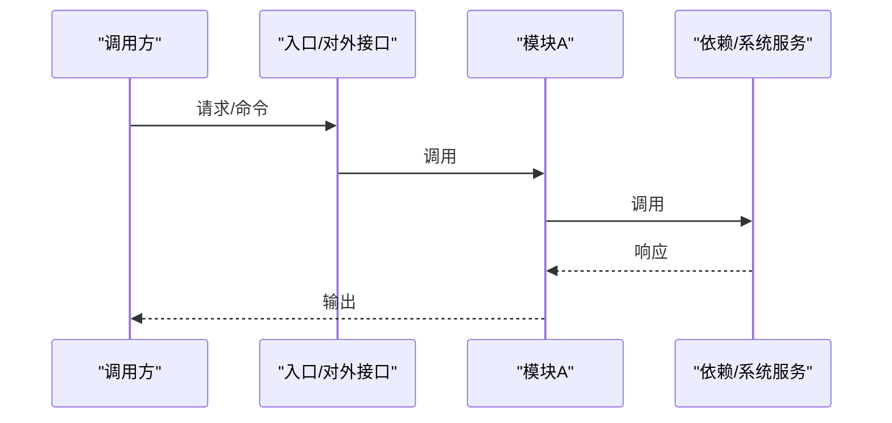
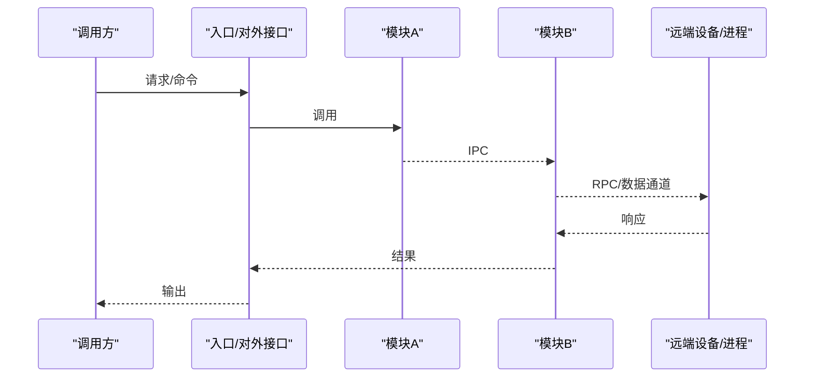

# 代码架构分析

## 1. 进程与模块总体视图

- 分析范围：<仓库列表/路径/分支>
- 调用方边界：外部系统/应用/用户/SDK（具体名称）
- 本仓代码边界：<仓库范围>
- 本仓服务内模块划分依据：按能力划分
- 底层模块：<主要依赖>

> **连线图例**：`IPC` = 跨进程通信；`RPC`/`跨设备` = 跨设备/跨节点通信；`进程内调用` = 同进程函数调用（无 IPC）。若本仓无跨设备 RPC，需显式注明「本仓无跨设备 RPC」。

## 2. 核心模块职责（按边界划分）

| 边界 | 模块/能力 | 入口/对外接口 | 职责说明 |
| --- | --- | --- | --- |
| 调用方边界 | <调用方> | <入口A> | <说明> |
| 本仓服务内模块 | <模块A> | <入口B> | <说明> |
| 底层模块 | <依赖A> | <接口/系统服务> | <说明> |

## 3. 典型运行场景一：<场景名称>

- 调用方：<外部系统/应用/用户/SDK>
- 入口：<入口函数/接口/命令>
- 调用链：<模块A -> 模块B -> 模块C>
- 输出/效果：<结果>
- 说明：必须包含对应的 Mermaid 图（推荐 sequenceDiagram）。

## 4. 典型运行场景二：<场景名称>

- 调用方：<外部系统/应用/用户/SDK>
- 入口：<入口函数/接口/命令>
- 调用链：<模块A -> 模块B -> 模块C>
- 输出/效果：<结果>
- 说明：必须包含对应的 Mermaid 图（推荐 sequenceDiagram）。

## 5. 典型运行场景三：<场景名称>

- 调用方：<外部系统/应用/用户/SDK>
- 入口：<入口函数/接口/命令>
- 调用链：<模块A -> 模块B -> 模块C>
- 输出/效果：<结果>
- 说明：必须包含对应的 Mermaid 图（推荐 sequenceDiagram）。

## 6. 典型运行场景四：<场景名称>

- 调用方：<外部系统/应用/用户/SDK>
- 入口：<入口函数/接口/命令>
- 调用链：<模块A -> 模块B -> 模块C>
- 输出/效果：<结果>
- 说明：必须包含对应的 Mermaid 图（推荐 sequenceDiagram）。

## 7. 典型运行场景五：<场景名称>

- 调用方：<外部系统/应用/用户/SDK>
- 入口：<入口函数/接口/命令>
- 调用链：<模块A -> 模块B -> 模块C>
- 输出/效果：<结果>
- 说明：必须包含对应的 Mermaid 图（推荐 sequenceDiagram）。

## 8. 依赖清单

- <依赖名称>：<用途>
- <依赖名称>：<用途>

## 9. 使用方法（面向开发人员）

- 如何接入/调用：<简要步骤>
- 关键配置/编译选项：<简要>
- 常见入口与示例：<简要>
